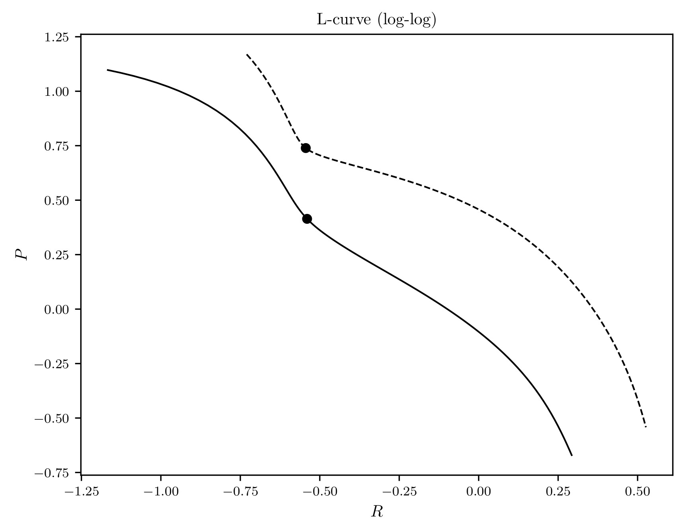
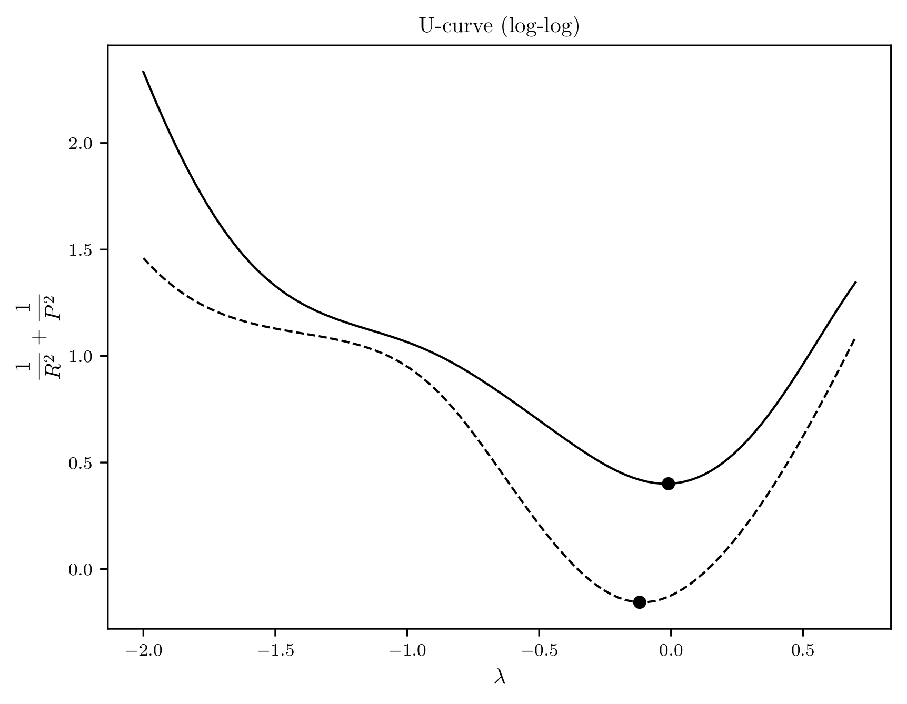
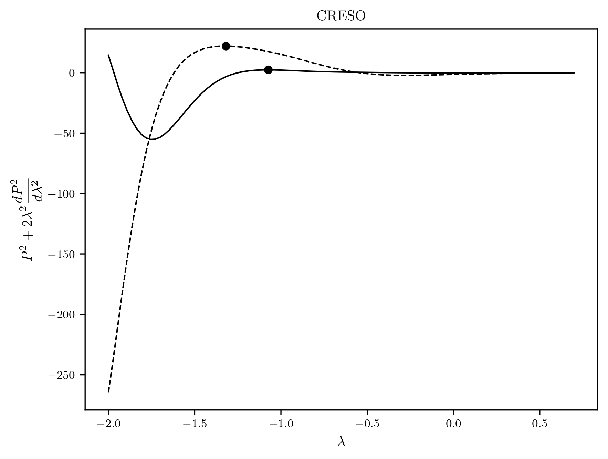

# $\lambda$-opt

A project with hyperparameter selection criteria such as L-curve, U-curve & CRESO. In each case, the optimum is computed as max curvature, minimum and first local maximum points, respectively.

You can use the `AbstractCriteria` class to implement new criteria.

### Usage
```python
from lambda_opt import LCurve

P = # penalization terms with shape lambdas.size
R = # residual terms with shape lambdas.size
lambdas = # hyperparameters in ascend order
criteria = LCurve(P, R, lambdas) # choose LCurve, UCurve or CRESO
x, y = criteria.compute_curve() # compute the (x, y) curve
opt = criteria.get_optimum() # compute the optimum index

```

### Example
Let $A$, $B$ random matrices of shape $50 \times 50$ and $y$ random measurements. Solving `Ridge(A)` (solid) & `Tikhonov(A, B)` (dashed) regularizers to $y$ and setting $\lambda$ range betuween .01-5. We get,






